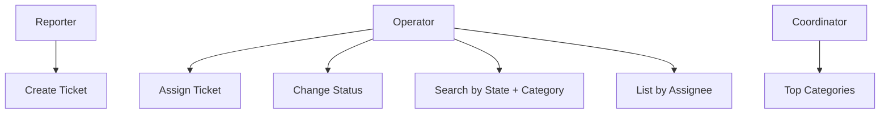
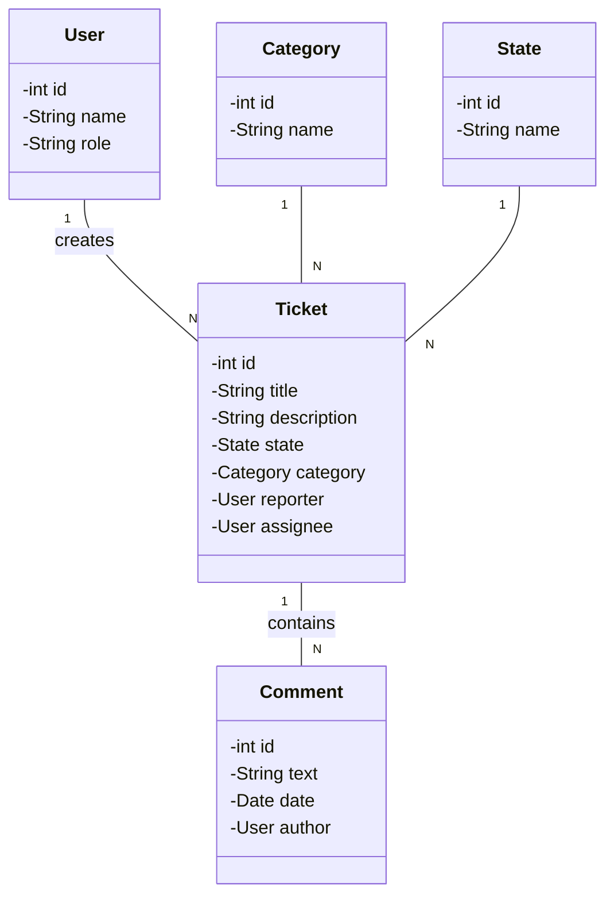
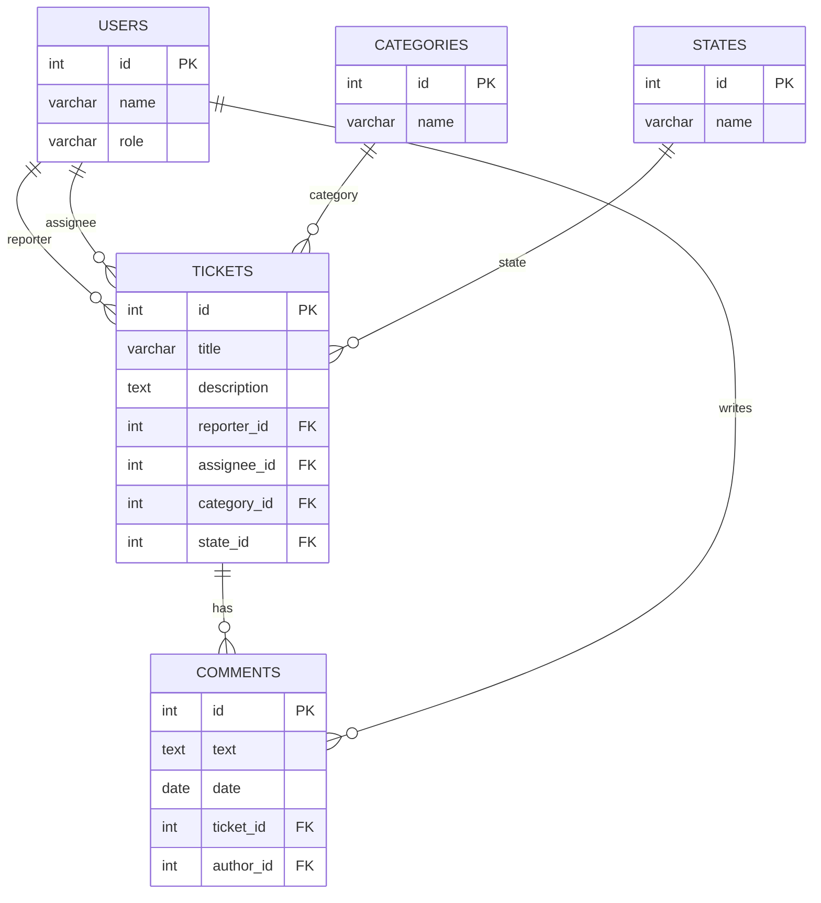

# ticket-support-systems_umi

## 📌 Description
Academic project for a **Ticket Support System** in Java.  
The system allows creating, assigning, updating, and querying support tickets.  
It runs in a **console (or minimal view)** and uses **JDBC with PostgreSQL (Supabase cloud)** through a **DAO layer**, with queries that include **JOINs** and aggregation operations.

---

## 🎯 Objective
- Develop a Java application to manage support tickets.  
- Implement functionalities such as: ticket creation, assignment, status change, filtering, and simple reports.  
- Use **abstract classes, interfaces, ArrayList, and HashMap** where applicable.  
- Persist data using **PostgreSQL (Supabase)** and **JDBC**.  

---

## 🛠️ Requirements
- **Java 11+**  
- **PostgreSQL 14+ (Supabase cloud)**  
- **PostgreSQL JDBC Driver**: [`postgresql-42.7.4.jar`](https://jdbc.postgresql.org/download/postgresql-42.7.4.jar)  

---

## ⚙️ Setup
1. Download the JDBC driver:  
   bash
   # Linux / MacOS
   wget https://jdbc.postgresql.org/download/postgresql-42.7.4.jar

   # Windows (PowerShell)
   curl -O https://jdbc.postgresql.org/download/postgresql-42.7.4.jar
`

2. Compile and run the project with the `.jar` in the classpath:

   bash
   # Compile
   javac -cp .:postgresql-42.7.4.jar src/app/Main.java  

   # Run
   java -cp .:postgresql-42.7.4.jar src.app.Main
   

   ⚠️ On Windows replace `:` with `;` in the classpath:

   powershell
   javac -cp .;postgresql-42.7.4.jar src\app\Main.java
   java -cp .;postgresql-42.7.4.jar src.app.Main
   

3. Configure connection in `/config/DbConfig.java`:

   java
   private static final String URL = "jdbc:postgresql://db.<project>.supabase.co:5432/postgres";
   private static final String USER = "postgres";
   private static final String PASSWORD = "****"; // Supabase password
   

---

## 📂 Project Structure

/src
  /app        -> Main entry point
  /controller -> Orchestration of use cases
  /view       -> Console menus / minimal view
  /domain     -> Entities (User, Ticket, Category, State, Comment)
  /dao        -> Interfaces and JDBC classes
  /service    -> Business rules
  /config     -> Database configuration (DbConfig)
  /util       -> Utilities (dates, formatting, helpers)

---

## 📋 Main Features

* Register and list users (roles: **reporter** and **assignee**).
* Create tickets with title, description, category, and initial state (**Open**).
* Assign tickets to a user.
* Change state: Open → In Progress → Resolved/Closed.
* Search tickets by state and category.
* List tickets by assignee (with reporter and category).
* Report the **Top 3 categories** with the most tickets.

---

## 🔑 SQL Queries (with JOINs)

* **List tickets by assignee**

  sql
  SELECT t.id, t.title, u.name AS reporter, c.name AS category, s.name AS state
  FROM tickets t
  JOIN users u ON t.reporter_id = u.id
  JOIN categories c ON t.category_id = c.id
  JOIN states s ON t.state_id = s.id
  WHERE t.assignee_id = ?;
  
* **Filter by state and category**

  sql
  SELECT t.id, t.title, u.name AS reporter
  FROM tickets t
  JOIN users u ON t.reporter_id = u.id
  WHERE t.state = ? AND t.category = ?;
  
* **Top 3 categories with most tickets**

  sql
  SELECT c.name, COUNT(*) AS total
  FROM tickets t
  JOIN categories c ON t.category_id = c.id
  GROUP BY c.name
  ORDER BY total DESC
  LIMIT 3;
  

---

## 🧪 Example Execution (console)

===== Ticket Support System =====
1. Create Ticket
2. Assign Ticket
3. Change Status
4. Search by State + Category
5. List by Assignee
6. Top 3 Categories
7. Exit

---

## 📌 Workflow

* **Git Flow**:

  * `main` → production
  * `develop` → development
  * `feature/*` → new features
* **Azure Boards**:

  * Register user stories and tasks.
  * Track progress and traceability.

---

## 📊 UML Diagrams

### 🔹 Use Case

### 🔹 Class Diagram (simplified)

### 🔹 Database ER Model

